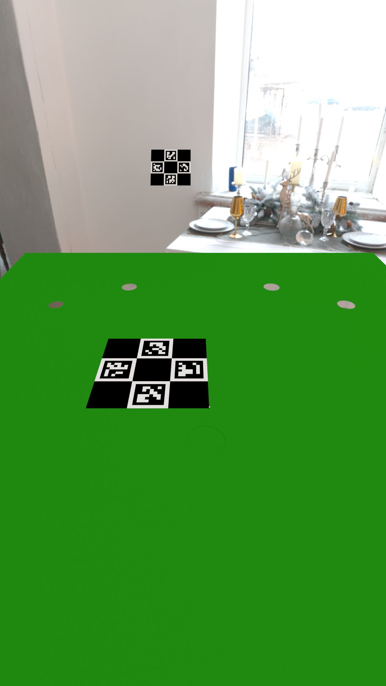
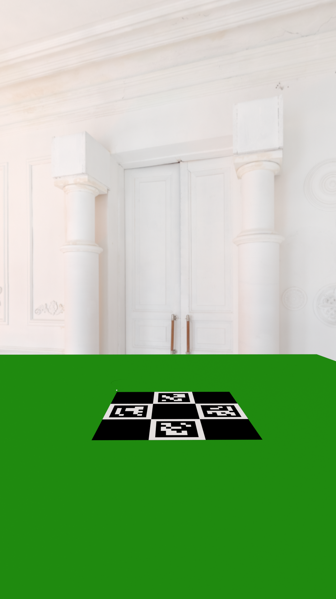
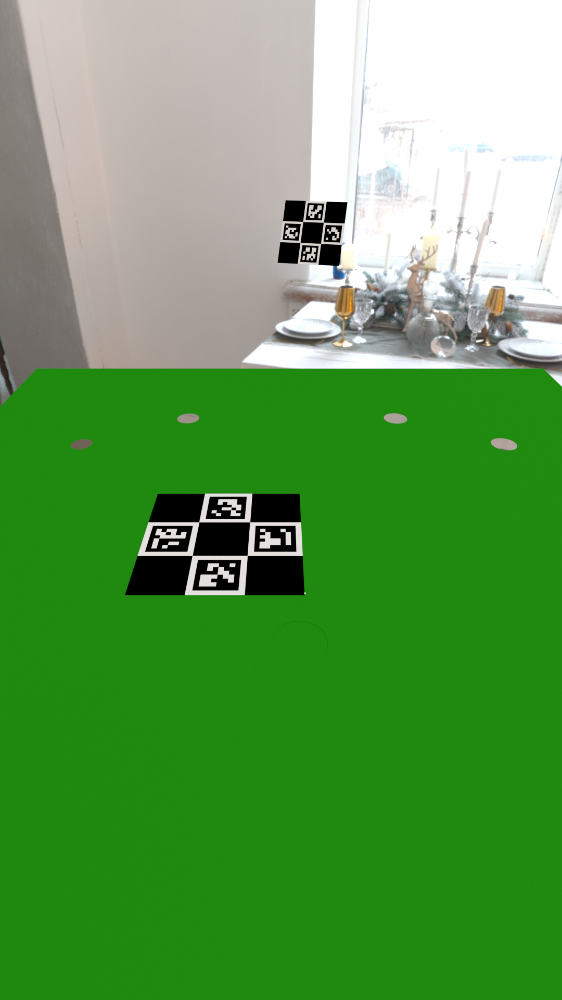
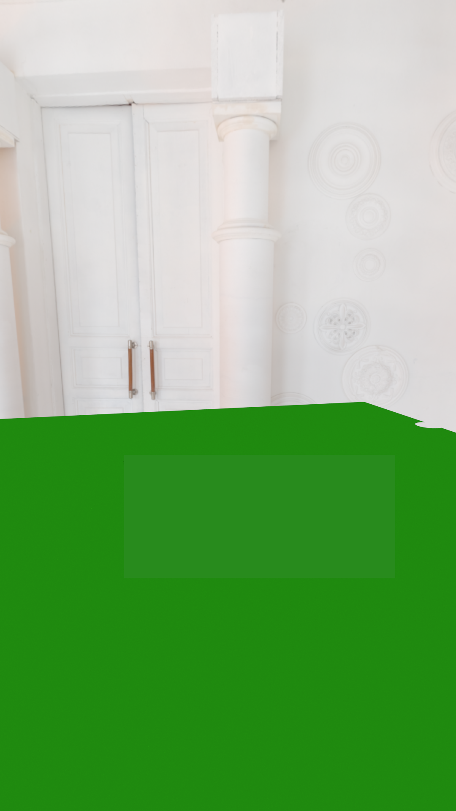

# Charuco coordinates transformation
Configurtation:  
* The FLOOR_TARGET is a static charuco board positioned on the floor.  
* The TRACKING_CAMERA is securely mounted, offering a wide-angle, top-down view of the entire scene, and its primary role is to accurately track the position of the FILM_TARGET.  
* The FILM_CAMERA, on the other hand, is mobile and features a FILM_TARGET, which is a charuco board affixed to its top.  
## Stage 1
At the start, we know all cameras position in the FLOOR_TARGET coordinarte system.  
We need to calculate the FILM_VECTORS, which are translation and rotation vectors from FILM_CAMERA to FILM_TARGET that will be used further.<br>
<div align="center">
<br>
<table style="border: none;">
    <tr>
        <th style="border: none;">Tracking camera</th>
        <th style="border: none;">Film camera</th>
    </tr>
    <tr>
        <td style="border: none;"></td>
        <td style="border: none;"></td>
    </tr>
</table>
</div>

## Stage 2
Even as the FILM_CAMERAs begin to move and rotate, our objective remains to accurately track the position and rotation of the FILM_CAMERA in the FLOOR_TARGET coordinate system, regardless of its visibility. To achieve this, we need to establish a chain of reference:  
FLOOR_TARGET -> TRACKING_CAMERA -> FILM_TARGET -> FILM_VECTORS  -> FILM_CAMERA
Consequently, we need a method that allows us to compute the FILM_CAMERA's position and rotation vectors in the FLOOR_TARGET coordinate system, even when the FLOOR_TARGET is out of sight of the FILM_CAMERA.  
<div align="center">
<br>
<table style="border: none;">
    <tr>
        <th style="border: none;">Tracking camera</th>
        <th style="border: none;">Film camera</th>
    </tr>
    <tr>
        <td style="border: none;"></td>
        <td style="border: none;"></td>
    </tr>
</table>
</div>

## What we have
* Three datasets:  
1. Both TRACKING_CAMERA and FILM_CAMERA can see FLOOR_TARGET  
2. Both TRACKING_CAMERA and FILM_CAMERA can see FLOOR_TARGET and FILM_CAMERA is moved  
3. Only TRACKING_CAMERA can see FLOOR_TARGET and FILM_CAMERA is moved  
Each dataset have view of two cameras: TRACKING_CAMERA and FILM_CAMERA.  
  
* Five charuco dictionaries  
  
* [charuco.py](https://github.com/format37/charuco_coordinates/blob/main/charuco.py) iterating all datasets, all dictionaries, all cameras. Trying to detect board and estimate the camera pose if board detected.  
Rotation and translation vectors are saved to the out folder in text format:  
For example, out/0/b_FilmCameraView.png.txt:
```
39.48273965613211,267.28585006705424,75.09798598707681
-0.42477284335665927,-90.03094989399408,-0.004643251335481424
```
Diagnostic image for each detected target are saved to the diagnostics folder:  
<br>

<br>
Finally, the 3d representation of camera vectors are plotted by matplotlib:  
<br>

<br>

## What we need
...