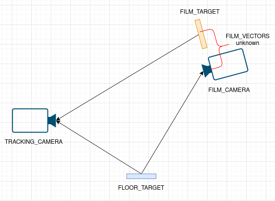
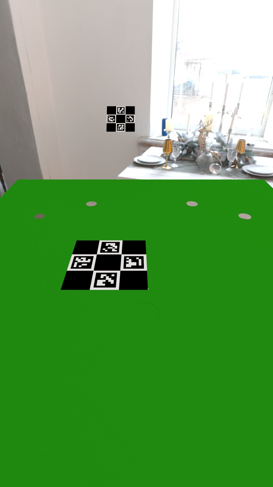
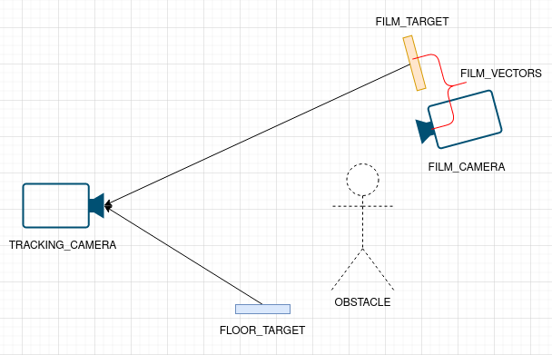

# charuco_coordinates
Charuco coordinates transformation

## Stage 1
First of all, we have a calibration stage, when all cameras can see the Floor charuco board.
There we need to calculate the Film vectors, which is translation and rotation vectors ftom Film camera to Film target. 

 
<table style="border: none;">
    <tr>
        <th style="border: none;">Tracking camera</th>
        <th style="border: none;">Film camera</th>
    </tr>
    <tr>
        <td style="border: none;"></td>
        <td style="border: none;"></td>
    </tr>
</table>

## Stage 2
Next, even if the floor charuco board is not visible, we still need to be able to calculate the Film camera position and rotation vectors in the floor charuco board coordinate system. In addition we need to account that the film camera had changed its position and rotation.  
 
According camera views is: 

## Summary
